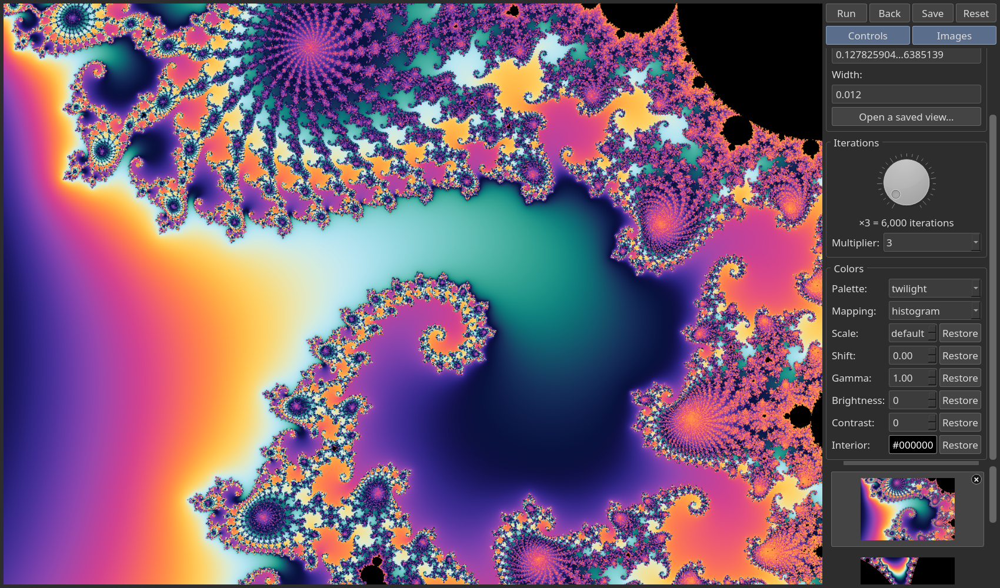
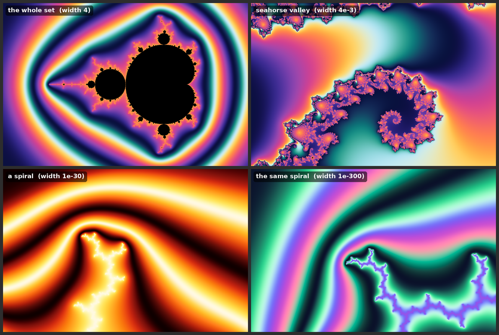
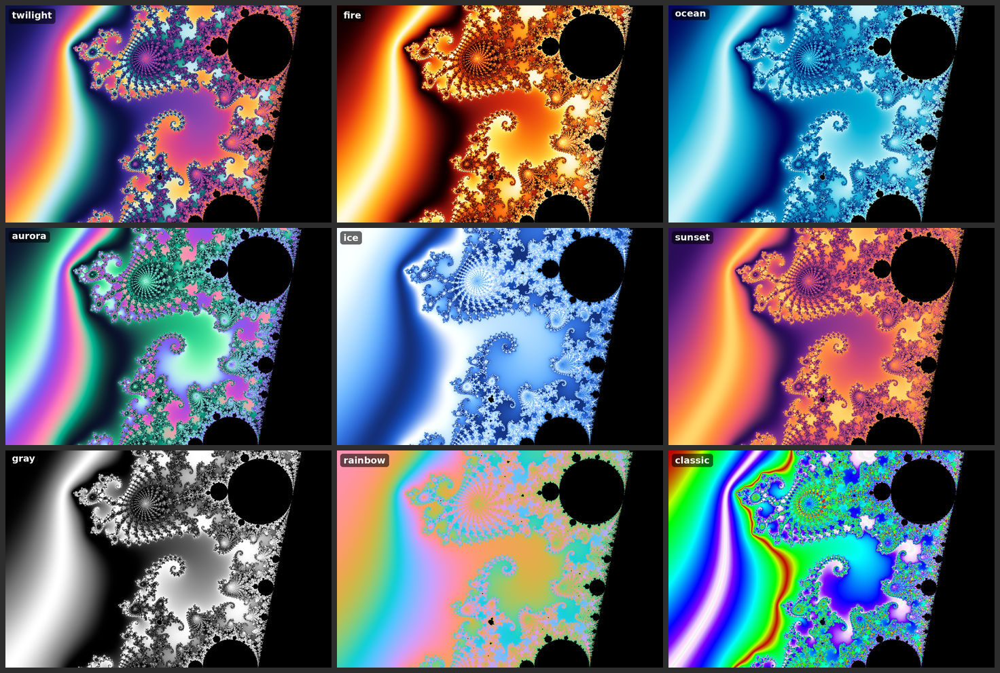
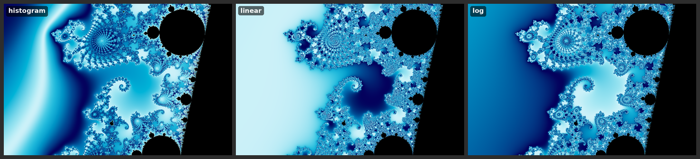

# gpumand

A Mandelbrot set explorer: drag a box around anything that looks interesting, press Run, and zoom in again, and again, far past the point
where ordinary floating point gives up. It runs on a CUDA GPU, or on plain CPU cores if you don't have one. Hours of fun -- seriously!

## What it does

* **Point-and-zoom.** Drag a rectangle on the picture, press **Run** (or Enter), and that region is drawn full size. Every view you make is
  kept as a thumbnail, so **Back** and the thumbnails take you anywhere you have been.
* **Zooms past 1e-1000.** Plain double precision runs out near a view width of 1e-13. Below 1e-9 gpumand switches to *perturbation
  theory*: it works out one exact reference path with arbitrary-precision numbers, and every pixel only tracks its tiny difference from it.
  Coordinates are kept as exact decimals all the way, so repeated zooms never round off.
* **Smooth, pleasing colors.** Nine palettes, three ways of spreading them over the image, and no color banding. Changing a color setting
  repaints the picture instantly without drawing it again.
* **Save and reopen.** Saved pictures are PNG files that remember where they came from, so **Open a saved view** brings one back as a
  live view you can recolor and keep zooming into.
* **Tidy.** It cleans up after itself and asks before throwing anything away.

## Install

You need Python 3 with PyQt5 and `gmpy2` (`pip install PyQt5 gmpy2`), and one of:

* **No GPU:** `gcc` with OpenMP. This builds the renderer `mand-cpu`.

      $ git clone https://github.com/oscarpoppa/gpumand.git
      $ cd gpumand
      $ make cpu            # builds mand-cpu and colorize

* **NVIDIA GPU:** CUDA's `nvcc`. This builds the renderer `mand-gpu`.

      $ make gpu            # builds mand-gpu (CUDA) and colorize; pass ARCH=sm_XX for your card, e.g. make ARCH=sm_86 (default sm_50)

  (Plain `make` does the same as `make gpu`, and `make all cpu` builds both.)

### Required: tell the GUI which renderer to use

The GUI draws pictures by running a separate program, and **you must set `renderer` in `mand-gui.ini` to the one you built**:

* `renderer=mand-cpu` if you built with `make cpu` (no GPU).
* `renderer=mand-gpu` if you built with `make gpu` (CUDA GPU).

If `renderer` is missing, the GUI assumes `mand-gpu`, so a CPU-only install will fail to render until you set it. The symptom is a
"Render failed" message: either the program cannot be run (it was never built), or `mand-gpu` starts and stops with "no CUDA-capable device". Edit `mand-gui.ini` (or copy it and pass your own with `--ini`). It also says where
the programs are and where saved pictures go by default:

    [paths]
    save_dir=/home/you/Pictures      # where Save starts
    bin_dir=/home/you/gpumand        # the folder with mand-cpu (or mand-gpu), colorize and mand-gui.py
    renderer=mand-cpu                # REQUIRED: mand-cpu (made by `make cpu`) or mand-gpu (made by `make gpu`)

The GUI starts either way, but it can only draw with a renderer that has been built, so set this before your first Run.

Run it:

    $ ./mand-gui.py [-i,--ini=your.ini]

## Using it

| Control | What it does |
|---|---|
| Drag on the picture | Draws a selection box (always the picture's own shape). Its exact coordinates appear on the right. |
| **Run** (or **Enter**) | Draws the selection. If you haven't made a new selection, it redraws the current view in place, which is how you apply a new iteration limit. |
| **Back**, thumbnails | Return to an earlier view. Every control (coordinates, multiplier, palette, mapping, scale, shift) then shows that view's own settings, and a region boxed from it starts from them, not from whatever you used last. The selected thumbnail has a tiny **×** in its corner: it deletes that view and all of its files (after asking), and shows the view before it. Views that were zoomed from the deleted one now hang from its parent, so **Back** always goes to the next real view back. The opening view has no ×. |
| **Save** | Writes the picture on screen as a PNG (see below). |
| **Open a saved view...** | Draws a view from a PNG this program saved. |
| **Reset** | Back to the whole set (it may ask about old files first). |
| Iterations dial / Multiplier | The most iterations a render may use is 2000 times the multiplier, up to 20 million (40 billion iterations). More iterations fill in black areas of deep views but take longer. |
| Colors | Palette, mapping, Scale and Shift. Each change repaints at once. The **Restore** buttons put Scale and Shift back to their starting values. |

The picture grows with the window. If the window's shape doesn't match, up to 15% of the picture is trimmed from the edges rather than
stretching it. The coordinate boxes show long numbers in short form, such as `-0.743643887...6114774` and `1.23456789...8901234e-45`:
the first digits, the last digits and the power of ten. Hover over a box to see every digit.

### Colors

Colors come from a *smooth* iteration count, so there are no bands. There are nine palettes:

and three **mappings** that decide how counts become colors:

* `histogram` (the default) spreads the colors evenly over whatever is in the picture, at any depth.
* `linear` gives a fixed number of iterations per color cycle (Scale sets the number).
* `log` cycles the colors once per doubling of the iteration count.

**Scale** sets how fast the colors cycle (blank means a good value for the mapping). **Shift** slides every color around the palette
without changing the pattern; 1 is one full turn, which looks the same as 0.

### Saving, reopening and cleaning up

**Save** writes a PNG that remembers its view: the exact coordinates (every digit), the iteration multiplier, and the color settings, stored
as ordinary PNG text fields that any PNG tool can read (for example `exiftool`). **Open a saved view...** reads them back, checks every field,
and draws the view again as a new entry in the history. It only opens `.png` files that really are PNGs and that this program saved. Redrawing
takes as long as the original render did.

Every render leaves files in `pix/`: the picture, plus a `.nu` file of the raw counts that makes recoloring instant. Changing colors replaces a
view's picture in place and redrawing a view with a new iteration limit replaces its files, so nothing piles up. When you **quit** or **Reset**
with generated files around, it asks what to do:

* **Delete all** removes them.
* **Keep all...** asks for a folder, then keeps each view's picture there as a PNG that remembers its view (inside a new dated folder, so
  nothing is overwritten). The raw `.nu` counts are not kept. Choose `pix/` itself to leave everything where it is.
* **Cancel** stays open, or doesn't reset.

The × on a thumbnail deletes just that view's files (its picture, counts and any leftovers, matched by exact name). Only files the program made, by exact name in `pix/`, are ever deleted. Pictures you saved, kept pictures and the shipped `pix/whole.bmp` are
never touched. On Reset the opening view's own files are spared (it needs them), and if only those are left when you quit they are removed without
asking: they are redrawn at the next start.

## Deep zoom, in a little more detail

| Technique | What it does |
|---|---|
| **Perturbation** (`deepzoom.py`, `pert.h`) | One arbitrary-precision reference orbit at the view's center (needs `gmpy2`); each pixel iterates only its small offset from it, in ordinary doubles. |
| **BLA skipping** (`bla.c`, `pert.h`) | Bilinear-approximation tables let a pixel skip runs of up to thousands of iterations at once while its offset is tiny: about 15 times fewer loop steps at width 1e-200. Orbits over about 4 million points get no table (memory). |
| **Floatexp** (`pert.h`) | Below a pixel step of about 1e-271 the offsets carry their own exponent, so views past double's 1e-308 limit work (tested to 1e-1000). It costs about the same per iteration as the double path: a 1e-400 view takes about 2.5 seconds on 8 CPU cores. |
| **Rebasing** | When a pixel's path outruns the reference, or its full value becomes smaller than its offset, it restarts relative to the start of the reference. That avoids the usual "glitch" blobs without extra reference orbits. |

Reference orbits are capped at 16.7 million points. A pixel that outlasts the reference starts over from it, so the cap affects only pixels
that take longer than that to escape. A view with much of its area inside the set is slow at the top of the iteration range, since every
inside pixel runs to the full limit. It can take hours, and the window stays busy until the render finishes.

## The CPU renderer

`mand-cpu` takes the same arguments and writes the same output as the GPU `mand-gpu`, using the same per-pixel code, spread over your cores with
OpenMP. It is fast for ordinary and deep views, a couple of seconds even below 1e-300. The slow case is a very high multiplier on a shallow
view, which has nothing to skip. `OMP_NUM_THREADS` sets the thread count, and `MAND_VERBOSE=1` reports which render path was taken (plain,
perturbation with BLA, or floatexp).

## Command line

    $ mand-cpu X Y WIDTH OUT.bmp MULTIPLIER [REFERENCE_FILE] [options]

`X Y` is the lower-left corner and `WIDTH` the width of the view (decimal text, as many digits as you like). Views narrower than 1e-9 need a
reference orbit first: `deepzoom.py X Y WIDTH MAXITER FILE` writes one, which you pass as `REFERENCE_FILE`. Options can go anywhere on the line:

    --palette=NAME  --mapping=histogram|linear|log  --scale=N  --shift=N  --interior=RRGGBB
    --nu-out=FILE        also save the raw smooth counts

`colorize FILE.nu OUT.bmp [options]` recolors saved counts without rendering, and `colorize --list-palettes` lists the palettes.

## Tests

No GPU needed:

    $ python3 -m unittest discover -s tests

The suite (over a hundred tests) checks the deep-zoom math against exact arbitrary-precision iteration, the renderers against independent
re-implementations, the palettes, the PNG metadata reader, the cleanup rules, and the whole GUI, driven headlessly with both a fake and the
real renderer.

## Files

| | |
|---|---|
| `mand-gui.py` | The window. |
| `mand-gpu.cu`, `mand-cpu.c` | The GPU and CPU renderers. They share `pert.h` (the per-pixel code), `bla.c`, `colorize.c`, `refio.c`. |
| `deepzoom.py` | Reference orbits and exact coordinate math. |
| `colorize-main.c`, `colorize.c` | Palettes, mappings, and the recolor tool. |
| `meta.py` | The view description stored inside saved PNGs. |
| `cleanup.py` | Which files the program may remove, and how. |
| `docs/` | The pictures above. To redraw them: `make cpu`, then run `docs/make_images.py` and `docs/make_screenshot.py` (they need Pillow). |
| `tests/` | The test suite. |
